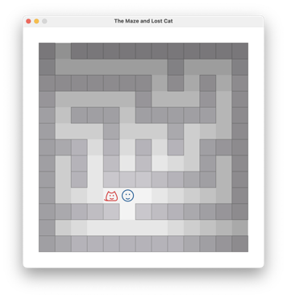
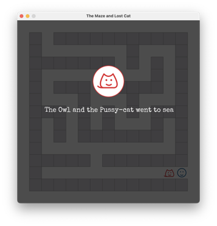
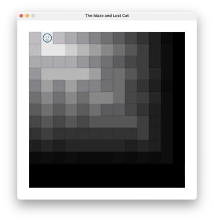
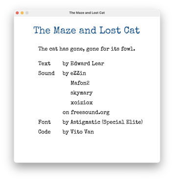

# Lisp Game Jam 2023

This repository contains the source code and devlogs for my Lisp Game Jam submissions.

## Autumn

~~Time is flying, is flying.~~

Damn, life came in.

> “I love deadlines. I love the whooshing noise they make as they go by.”
> ― Douglas Adams, The Salmon of Doubt 

## Spring: The Maze and Lost Cat

The Owl and the Pussy-cat went to sea

