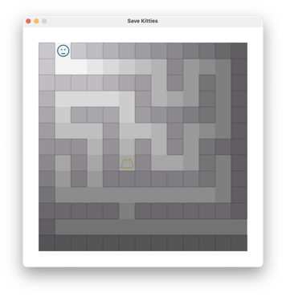
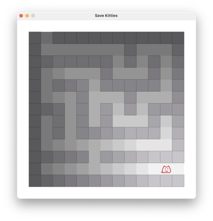
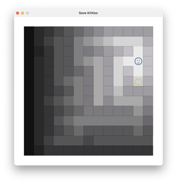
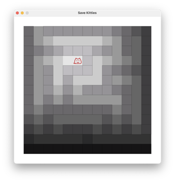

## Development Log

This is my development log for [Spring Lisp Game Jam 2023](https://itch.io/jam/spring-lisp-game-jam-2023), I started my work a bit late, but maybe I can finally make it.

### Day 4

3 days 3 hours left.

Let's sort out today's work:

1. BGM
2. Random Kitty Location
3. Fix Auto-move feature (should pause at the intersection)
4. More user incitement

#### day 4 update - 1

Let's see what we have done:

1. BGM, done, using one of GarageBand sound pack loop forever

   it's good to know that all sound pack in GarageBand is free as freedom and free-charge to use anywhere

2. Auto-move fixed

What's left?

1. Random Kitty Location
2. More user incitement

I found a poem by Edward Lear, it's weird and interesting: *The Owl and the Pussycat*

Maybe I could use this in my game, slice it into small pieces, show one piece of it each round, print out all of it at the end.

#### day 4 update -2

I integrated Edward Lear's text into my game! As an user incitement, the parts of the poem will show up after the player finished a maze. I also added a finish page.

#### day 4 update -2

I manually picked some nice spots for the kitties, and randomly pick from the list for the kitties to appear.

I think it's time to call it a day.

### Day 3

4 days left, actually, it's 3 days 20 hours left.

Sound effects added:

1. Kitty will meow, the closer you get, the louder the meow is
2. Walk will generate walking sound, if you hit the wall, there will be no sound
3. When you collected the kitty, there will be a special meow
4. When you successfully lead the kitty out of the maze, there will be purring.

Now kitty will follow the player, if they have met each other (overlapped), and some other small improvement on the avatars.

Now, added dark mode, even in complete darkness, the game is also playable:

 

But it's far more difficult.

And the day can turn into night, the night can turn into day.

I should call it a day, tomorrow should be:

- doing more sound effect, like BGM?

- should add more user incitements? But how?
- random kitty position

Oh, I also added a `auto-move` feature, which will save the player some key presses by auto-moving ahead, but it's buggy, could move ahead to much, should be fixed tomorrow.

### Day 2

5 days left.

I need to finish the prototype:

- ~~player moving (already done by day 1)~~

- Canned Cat Food

  player can pick up the can first, then Pupu will follow the player, but only in a cute way, that Pupu will not find the right path, but try to cross the wall (but she won't)

- Shit

  if the player stepped on a piece of shit, Pupu will try move away from the player.

- Win / Loose

  Timed game? There are 4 mazes, 8 levels in total. 

  - the first 4 levels are in daytime, so the player just play as usual.
    - level 1: player + Pupu
    - level 2: player + Pupu + canned cat food
    - level 3: player + Pupu + shit
    - level 4: player + Pupu + canned cat food + shit
  - the later 4 levels are in nighttime, so the player will only see the 8? blocks around

- position

  the initial position of Pupu and the player should be placed meticulously, not randomly.

#### Abandon

The above plan was abandoned, the game was redesigned.

Because the cat food and shit parts makes me feel trivial and uninteresting to implement. They feel like some hard-coded features, may take a lot of time to implement and debug, so I left them.

The story of this game should be told like this:

> It was getting dark and darker, some kitties were lost in a maze, how many of them can you save before the sunset? Or, do you have the ability to "see" in the dark? Give it a try.

There is no limit of rounds, the player could try as many times as the player wants, but the surrounding light will be dimmer and dimmer, at last it will turn into complete darkness.

Can a player play in the darkness?

I think it's possible if the kitty could meow and there are sound effects when the player hits the wall or walks through the maze.

Let's leave them tomorrow.

### Day 1

Today is May 30th 2023, Spring Lisp Game Jam 2023 has started 4 days ago, 6 days left.

That means: I don't have much time, so I have to find something easy to achieve, and interesting to play with.

#### Save Pupu

How about this: 

There is a kitty whose name is Pupu, she is young and energetic, so she goes out everyday, and get lost. The player's task is to find Pupu in a maze, and take her back home.

#### The Maze

I don't know how to make a maze, or even how to represent one in Lisp, so I searched around, here is something I found:

1. https://en.wikipedia.org/wiki/Maze_generation_algorithm
2. https://github.com/keesiemeijer/maze-generator
3. https://github.com/joewing/maze/blob/master/maze.lisp

The first link will take me more than 1 day to understand and implement; the second one is in JavaScript, may take me more than half a day to understand and rewrite to Lisp; the third one, is in Lisp, so be it.

But, it does not have a typical open source license, and I am not a lawyer, here is its license:

https://github.com/joewing/maze/blob/20b9e7ddfdfac96cd43f11b52f14924ceb1c25bc/LICENSE

Can I use the code with GPL-2.0 or WTFPL? I don't know.

So I have to read and understand the code, and close the page, and write my own version.

Then I write my own version, and rendered it with [CALM](https://github.com/VitoVan/calm/):

This seems promising, but:

Sometimes it generates unreasonable maze. 

This may take me a week to debug, maybe it's just a very little detail, but still, I don't have time to debug this. So the current decision should be:

Choose some better looking maze, and hard code their data in my game.

I gotta go, life comes in, I will leave this task to day 2.
